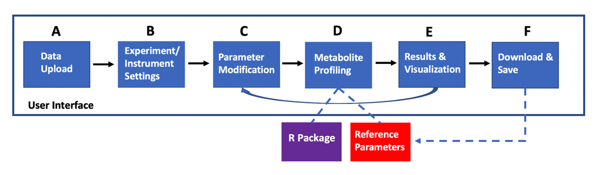
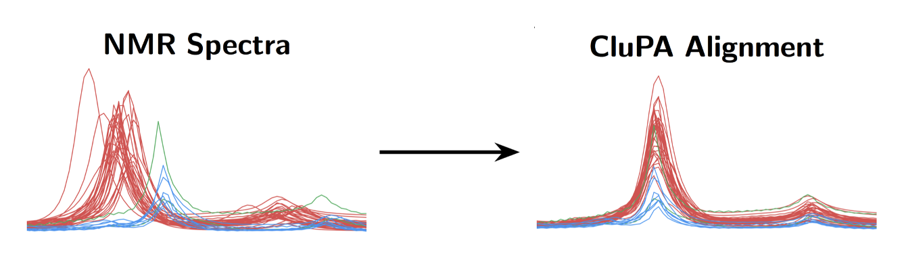
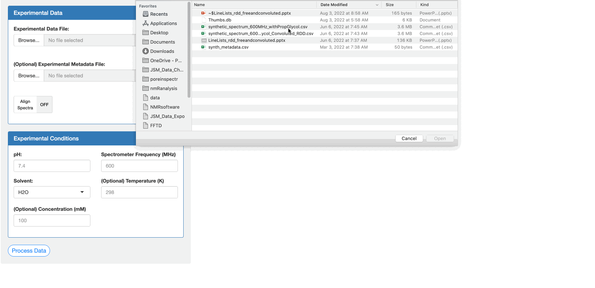
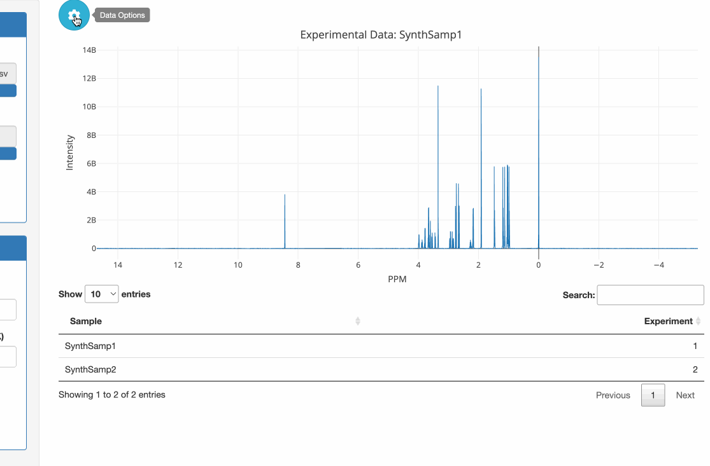
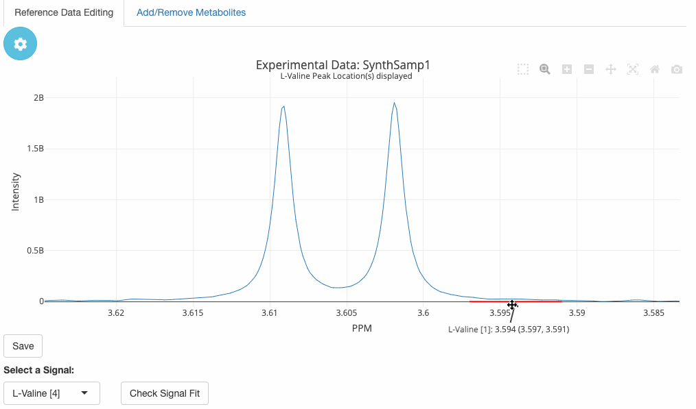
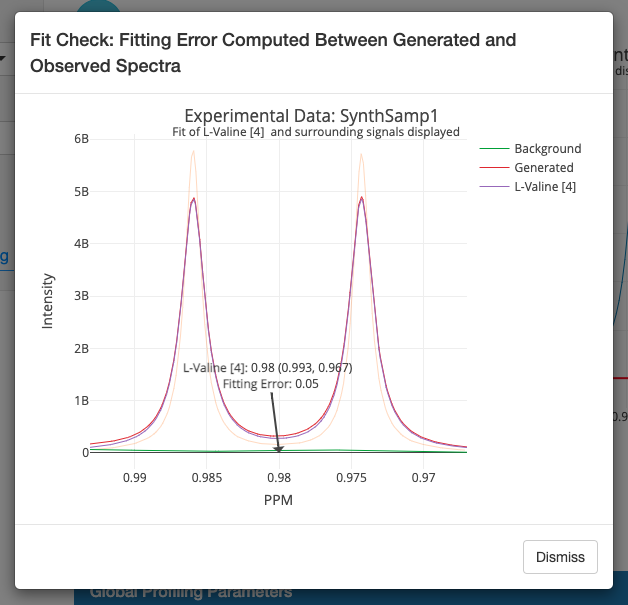
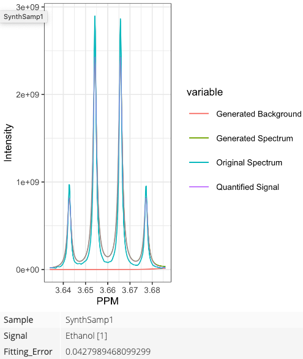
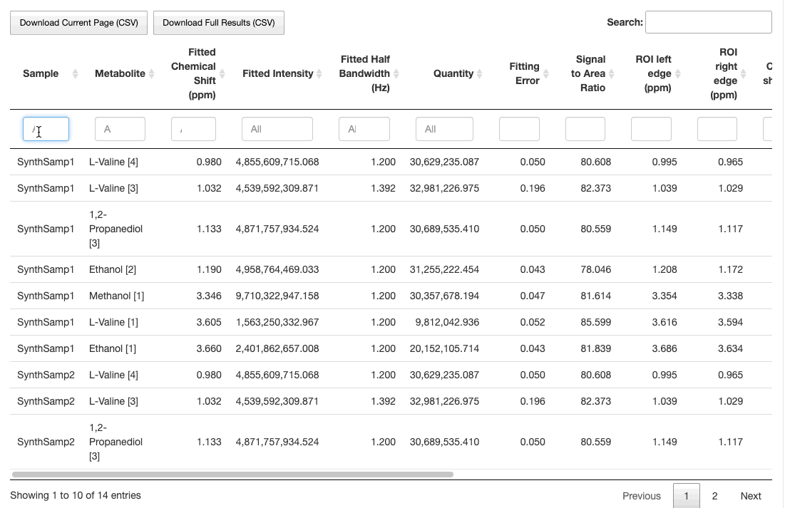
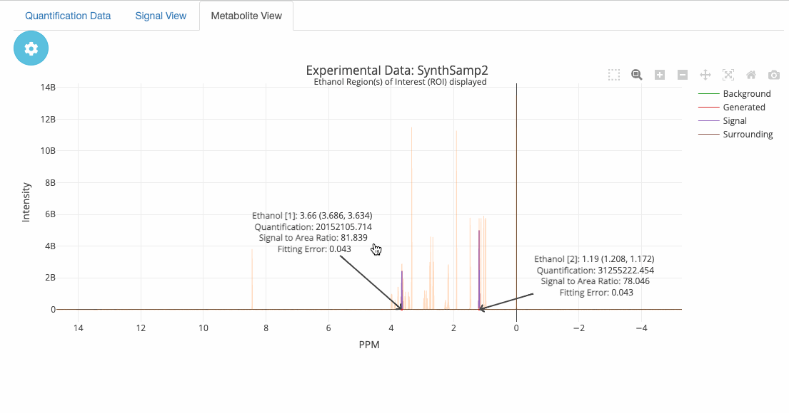

```{r Setup, include=FALSE}
knitr::opts_chunk$set(echo = TRUE,
                      fig.align = 'center')
library(knitr)
library(readxl)
```

# nmRanalysis Description

## Abstract
Current EMSL metabolomics capabilities enable automated Nuclear Magnetic Resonance (NMR) data acquisition, yet downstream processing of these data is manually intensive and time-consuming. The largest bottleneck among these downstream processes is feature (metabolite) quantification, a procedure that typically requires an experienced analyst several hours to complete for a single sample. Furthermore, given the manual nature of this task, quantifications across analysts for the same metabolite sometimes vary dramatically. Recognizing the inefficiency and lack of reproducibility inherent to this process, we have developed an open-source R package for semi-automated metabolite quantification that dramatically reduces processing time from approximately 40 hours to four hours for the quantification of 24 samples. Accompanying this software is a custom-built user interface that allows for more intuitive interaction between users and the software, particularly among users who are unfamiliar with the R programming language. The open-source code is available on GitHub (https://github.com/EMSL-Computing/nmRanalysis).

## User Interface Workflow

```{r, echo = F}

```

# App Installation & Launch

## Installation

1. Optional: If you are using a Windows machine and you do not already have it, install [Git Bash for Windows](https://git-scm.com/download/win).

2. If you do not have Docker installed, the easiest way is to [install Docker for desktop](https://docs.docker.com/engine/install/).

3. Open a Bash terminal and clone the nmRanalysis repository by copying the HTTPS URL available in the dropdown menu of the green 'Code' button at the top of the page:

```{bash, eval = F}
git clone https://github.com/EMSL-Computing/nmRanalysis.git
```

4. Navigate to the nmRanalysis directory with a `cd` command.

5. Build images with the following command:

```{bash, eval = F}
docker compose up --build
```

**Note: The build will take ~30 minutes the very first time.** Subsequent updates where only nmRanalysis and not its dependencies are loaded should take only a couple of minutes.

## Launch

Once the image is built and the container is running, you should get the terminal message:

"Listening on http:<!-- -->//0.0.0.0:3838"

To launch the app, open a web browser and type in "localhost:3838". You are now free to do your analyses through the app!

## Troubleshooting

* `renv` failed to install a dependency

If you have trouble with installing dependencies through `renv`, you might need to change the CRAN repository.

1. Open the Dockerfile in a text editor
2. Change line 31 to: 
```{eval = FALSE}
RUN R -e "install.packages('remotes', repos = c(CRAN = 'http://cran.rstudio.com/'), dependencies = TRUE)"
```

3. Save the Dockerfile changes and re-run the build command.

# Data Upload and Processing

## Page Description

This page prompts the user to upload two files:

1. A **required NMR spectra file** containing a $p * (n + 1)$ data table of spectra data, where $p$ is the number of PPM's observed and $n$ is the number of samples (an additional PPM identifier/name column should also be present anywhere in the data table). Each row corresponds to data for each PPM.

2. An **optional metadata file** containing a data table with $n$ rows. Each row corresponds to a sample with one column giving the unique sample identifiers and other columns providing qualitative and/or quantitative traits of each sample. Note that if a metadata file is not provided, these data will be automatically generated from the NMR spectra file and the specified experimental conditions.

To upload experimental data files, click on the "Browse..." button, then select files. 

If desired, perform peak alignment by toggling the "Align Spectra" button to "ON". This will add several minutes to the data processing time. If this option is selected, the data will be run through the hierarchical Cluster-based Peak Alignment (CluPA) algorithm provided by the [speaq R package](https://github.com/Beirnaert/speaq).

```{r, echo = F, out.width = "100%"}

```

Enter values for the experimental conditions Temperature (K), Spectrometer Frequency (MHz), Solvent, and, optionally, pH and Concentration (mM). 

When satisfied with the above entries, click the "Process Data" button. Keep in mind that if "Align Spectra" is set to "ON", this process will take several minutes. 

```{r, echo = F}

```

## Plots and Tables

When the data have been processed, an interactive plot of spectra and a data table will appear in the right panel. This plot and all others generated within the app are produced with the Plotly package and allow for interactivity such as zooming and panning. By hovering over the plot, the user will see the exact PPM and Intensity values associated with specific peaks. Additional interactive features can be accessed using the icons that appear at the top right of each plot. This plot and others throughout the app can be saved in their current state at any time as a png file by clicking the camera icon on the top right of the plot pane.

Clicking on the blue and white gear icon on the top left of the plot pane will show a small menu panel with options that allow the user to choose which spectrum to plot, show a subplot on box select, or apply filters by PPM. 

```{r, echo = F}
include_graphics("upload_plots.gif")
```

If the "Show subplot on box select" toggle is applied, a small plot viewer will pop up when a portion of the plot is selected with the box select tool. This subplot shows the selected region, with the current sample highlighed in blue. By clicking the legend item corresponding to the current sample, the blue line is toggled off and the user can see what the other sample spectra look like in that subplot region. Hover over the grey sample lines to see which sample each line represents.

```{r, echo = F}

```

PPM filters are applied by specifying a range of PPM values to omit from the plot. There is no limit to the number of filters that may be applied. To remove a filter, the user must type the exact PPM values that were initially specified for the desired filter.

Progress to the next step by clicking the "Reference Data Editing" button.

# Reference Data Editing

## Page Description

On this page, the user is prompted to select an import method for reference metabolite(s), either through uploading a file or specifying from list.

* **To specify reference metabolites using an uploaded file**, the file must be in the format of Mnova/Chenomx ouput. These are tabular files, either CSV or XLSX, in which the column names are located in the third row and the data begin on the sixth row. This file must include a column containing the CAS numbers of the relevant metabolites. An example of this file format can be downloaded [here](./concentrations_with_CAS.xlsx).

* **To specify metabolites from a list**, click the "List reference metabolite(s) of interest" box, where you can type the names of metabolites or scroll through the options to select metabolites present in the reference database. Once satisfied with your selection, click the "Query Reference Database" button. 


## Plots and Tables

When the query has been processed, a spectrum plot will appear in the right pane showing the location(s) of the first metabolite peak(s), indicated by the black arrow(s). These metabolite labels can be dragged and dropped to spread them out and make them easier to read. Select the blue and white gear icon at the top left of the plot pane to select which spectrum to plot and select which metabolite to display and edit.

To fine-tune the signal fits of identified metabolites, drag and stretch the red line along the x-axis on the plot. The black arrow should point to the peak center. Adjust the chemical shift tolerance in the data table below to control how much room there is about the peak center during the fitting step. 

```{r, echo = F}
include_graphics("ref_dat_edit.gif")
```

Additionally, the box select option can be used to measure the difference in PPM, Hz, and intensity between two peaks.

```{r, echo = F}

```

A data table of matching metabolites is provided below the spectrum plot. These are the closest-matching metabolites based on the values specified on the the previous page for spectrometer frequency, pH, concentration, temperature, and solvent. Most of the fields in this data table are editable, allowing the user to change, for example, the chemical shift tolerance or multiplicity of a given metabolite. 

## Add/Remove Metabolites

The Add/Remove Metabolites panel allows the user to add metabolites from a list ("Select from Existing") or by specifying a new metabolite. Metabolites can be removed from the analysis by choosing from the drop down menu "Select Metabolite(s) to Remove." An updated data table is produced below the metabolite selection pane. When metabolites are added manually, they will be assigned default values including a chemical shift of 0 PPM. These values can be edited in the data table.

## Global Profiling Parameters

The following parameters are available for signal fit tuning by clicking the "Global Profiling Parameters" bar:

* **Bandwidth Tolerance (Hz):** plus-minus value controlling tolerance for half bandwidth 
* **Pseudo-Voigt Lineshape Gaussian Ratio:** value between 0 and 1, signifies ratio of Gaussian to Lorentzian lineshape
* **J-coupling Tolerance (Hz):** plus-minus value controlling tolerance for J-coupling
* **Acceptable Fitting Error (%):** percentage error value at which the optimization algorithm will cease iteration if the maximum fitting iterations parameter has not yet been reached
* **Maximum fitting parameter optimization iterations** integer value, number of iterations (see description of Acceptable Fitting Error)
* **Background Signal (BGS) Density:** integer value that specifies the number of background signals (unknown metabolites) that would be expected to overlap over the span of 1 PPM
* **BGS Pseudo-Voigt Lineshape Gaussian Ratio:** value between 0 and 1, refers to lineshape of background signals
* **BGS Bandwidth (Hz):** specifies bandwidth for all background signals, default parameter values are derived from rDolphin (point to documentation)
* **BGS Bandwidth Tolerance (Hz):** plus-minus value controlling tolerance for BGS bandwidth

## Metabolite Signal Options

To see all of the available metabolites matching your query, toggle the "Display All Reference Entries" switch on the "Metabolite Signal Options" menu. If desired, toggle "Set Signal-Wide Half Bandwidth" to set the half bandwidth to the same value for the entire set of signals. Disable this feature to change values individually.

New metabolite signals can be manually added to the plot by clicking the "Add New Signal" button. By default, this new signal will be placed at a chemical shift of 0 PPM and will have the same values of the experimental parameters (spectrometer frequency, pH, concentration, temperature, and solvent) as were specified on the data upload page. These fields can be manually edited. 

## Check Signal Fit

At any time during the fine-tuning process, the desired signal fit can be checked by clicking "Save" and then "Check Signal Fit." A subplot will pop up showing the fitting error computed between the generated and observed spectra. This plot will consist of the following lines, which can be toggled on or off by clicking their respective labels in the legend:

* **Generated:** sum of signal line and background signal line
* **Background:** fitted to signals that may be present but are not accounted for in the spectrum. Essentially, this line represents an attempt to fit a signal to any hypothetical background metabolites that have been omitted because they can't be identified (refer to [rDolphin publication](https://link.springer.com/article/10.1007/s11306-018-1319-y) for more details).
* **Metabolite:** actual signal line, labeled with name of metabolite


```{r, echo = F, out.width='85%', fig.align='center'}

```

Checking the signal fit will automatically adjust parameters such as half bandwidth and J coupling, and these values will be updated in the data table. If satisfied with the results, click "Save" to preserve the values, and change the tolerance parameters in "Global Profiling Parameters" to 0 to prevent them from changing. If not satisfied with the changes, click "Revert Last Save" or "Revert All Saves" to return to a prior state.

When finished editing reference data and adjusting the signal fits, click the "Profiling" button on the bottom of the left panel to continue to the next page.

# Profiling

## Page Description

Upon clicking through to the "Profiling" page, the user will see a summary plot and data table of all of the edits made on the previous pages but with peaks aggregated into regions of interest (ROIs). These ROIs combine signals close to one another and group them into a single region. These groupings account for overlapping or non-overlapping signals.

The "Signal View" and "Metabolite View" tabs are empty until profiling is performed, at which time they will be populated with final results and visualizations.

## Quantification Data

Clicking on the gear icon at the top left of the spectral plot brings up drop-down menus allowing the user to select the spectrum to plot and the region of interest (ROI) whose fitting data should be displayed. The ROIs are represented by ordered pairs of PPM values. 

The [Global Profiling Parameters] values from the previous page will be carried over to the profiling page. However, these values can be adjusted from the drop-down panel on the left before profiling (e.g., to specify leeway in bandwidth or J-coupling tolerance, etc.). When satisfied with your selections, click the "Profile" button. This process takes longer when there are more metabolites to profile. When profiling is complete, the display automatically switches to the "Signal View" tab.

Update to this tab (deployed version)
upload fitting parameters button
ROI data will be automatically uploaded to internal database and added as new entry so future users can pull that entry and have that to start from in case they're working under similar experimental conditions


## Signal View

The signal view tab contains a customizable [Trelliscope](https://hafen.github.io/trelliscopejs/index.html) display of metabolite peaks, which can be enlarged by clicking the diagonal opposing arrows icon in gray at the bottom right of the plot pane. These plots consist of signal-by-signal fits of a signal to particular spectrum region.

The user can change number of plots viewed at once by adjusting parameters in the "Grid" menu on the left side of the plot pane. Choose which data to display by adjusting "Labels" parameters. Filtering can be performed on the basis of sample, signal, fitting error, etc. Likewise, sorting can be performed by the same variables.

```{r, echo = F, out.width='120%'}
include_graphics("trelliscope.gif")
```


The individual plots in the Trelliscope display each show four lines:

* **Generated Background:** akin to residual signal (described in [Check Signal Fit])
* **Generated Spectrum:** sum of quantified signal, background signal, and any surrounding signals (not necessarily displayed here - can be found in metabolite view)
* **Original Spectrum:** observed original spectrum
* **Quantified Signal:** line that corresponds to the fit of the labeled signal

```{r, echo = F, out.width='60%', fig.align='center'}

```

If fit is very good, with low error, the original spectrum and quantified signal lines will be hard to tell apart.

A data table containing the **full profiling results** with rows corresponding to each signal fit is provided below the plots. This table can be filtered by typing into the entry boxes below the column titles. A filtered version of the data table can be saved by clicking  "Download Current Page (CSV)" or save the entire data table containing all entries by clicking "Download Full Results (CSV)." 

```{r, echo = F}

```


## Metabolite View

This tab displays an interactive plot showing the entirety of each spectrum, with all regions of interest associated with each profiled metabolite. Each metabolite signal annotation points to the center of its corresponding signal. By clicking on the blue and white cog icon on the top left of the plot, the user can select which spectrum and metabolites to view. As in previous panels, there is an option to view fits across sample spectra by toggling "Show subplot on box select" in the cog icon menu.

```{r, echo = F}

```
